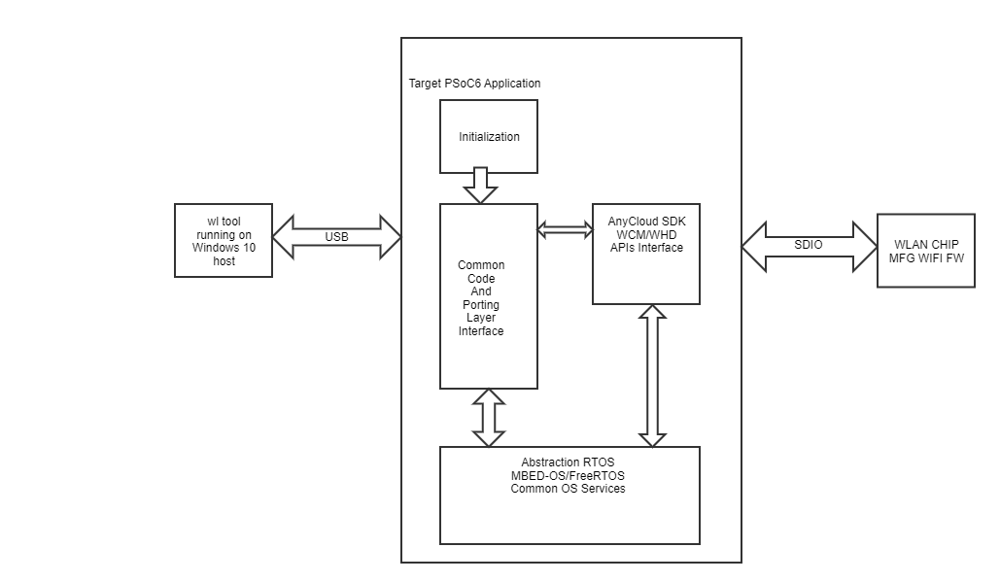

# PSoC&trade; 6 MCU: WLAN manufacturing test application (Wifi-Mfg-Tester) for FreeRTOS

The Wifi-Mfg-Tester v3.0.1 is used to validate the WLAN firmware and radio performance of Wi-Fi chips.

The Wifi-Mfg-Tester acts as a transport layer between the host "wl tool" and the WLAN firmware, and receives the commands from the wl tool and forwards them to the WLAN firmware using IOVAR/IOCTL commands. It also relays the response received back from the WLAN firmware.

The wl tool binaries for testing the WLAN firmware are also included in this application repository.

Wifi-Mfg-Tester v3.0.1 adds support for the following:

- [PSoC&trade; 64 "Secure Boot" Wi-Fi Bluetooth&reg; -  pioneer kit (CY8CKIT-064B0S2-4343W)](https://www.cypress.com/CY8CKIT-064B0S2-4343W)
- [ModusToolbox™ software](https://www.cypress.com/products/modustoolbox-software-environment) v2.3
- FreeRTOS v 10.3.1
- Arm&reg; C v6.14.1 toolchain

## Requirements
- [ModusToolbox™ software](https://www.cypress.com/products/modustoolbox-software-environment) v2.2
- Programming Language: C
- Supported Toolchains: Arm® GCC (v9.3.1), IAR (v8.42)
- Associated Parts: All [PSoC&trade; 6 MCU](http://www.cypress.com/PSoC6) parts

## Dependent assets
- [Wi-Fi connection manager](https://github.com/cypresssemiconductorco/wifi-connection-manager)
- [Wi-Fi manufacturing test library](https://github.com/cypresssemiconductorco/wifi-mfg-test)


## Validated kits
- [PSoC&trade; 6 Wi-Fi Bluetooth&reg; prototyping kit](https://www.cypress.com/CY8CPROTO-062-4343W) (`CY8CPROTO-062-4343W`) - Default target
- [PSoC&trade; 62S2 Wi-Fi Bluetooth&reg; pioneer kit](https://www.cypress.com/CY8CKIT-062S2-43012) - (`CY8CKIT-062S2-43012`)
- [PSoC&trade; 6 Wi-Fi Bluetooth&reg; pioneer kit](https://www.cypress.com/CY8CKIT-062-WIFI-BT) - (`CY8CKIT-062-WIFI-BT`)
- [PSoC&trade; 62S1 Wi-Fi Bluetooth&reg; pioneer kit](https://www.cypress.com/CYW9P62S1-43438EVB-01) - (`CYW9P62S1-43438EVB-01`)
- [PSoC&trade; 64 "Secure Boot" Wi-Fi Bluetooth&reg; pioneer kit](https://www.cypress.com/CY8CKIT-064B0S2-4343W) - (`CY8CKIT-064B0S2-4343W`)

## Hardware setup

This application uses the board's default configuration. See the kit user guide to ensure that the board is configured correctly.

The application running on a PSoC&trade; 6 MCU kit and the test setup are shown below:



**Note:** The PSoC&trade; 6 Bluetooth&reg; LE pioneer kit (CY8CKIT-062-BLE) and the PSoC&trade; 6 Wi-Fi Bluetooth&reg; pioneer kit (CY8CKIT-062-WIFI-BT) ship with KitProg2 installed. ModusToolbox software requires KitProg3. Before using this application, make sure that the board is upgraded to KitProg3. The tool and instructions are available in the Firmware Loader GitHub repository. If you do not upgrade, you will see an error like "unable to find CMSIS-DAP device" or "KitProg firmware is out of date".


## Software setup

This application requires the WL tool running on a Windows PC and uses the UART port for communication with the target. The pre-built executables for the WL tool are available in the *wl-tool-bin/* directory.


## Using the application

### Building the app

On Linux and macOS, you can use any terminal application. On Windows, open the "modus-shell" app from the Start menu.

- `git clone https://github.com/cypresssemiconductorco/mtb-anycloud-wifi-mfg-tester`
- `cd mtb-anycloud-wifi-mfg-tester`
- `make getlibs`
- `make program TARGET=CY8CPROTO-062-4343W TOOLCHAIN=GCC_ARM`


## Operation

1. Go to the WL tool directory:
   ```
   cd wl-tool-bin/
   ```

2. Reset the board by pressing the SW1 button.

3. Run the command on Windows host for the WLAN chip on the target board:

   ```
   wl4343x.exe --serial <port> ver`
   ```

   For example:

   ```
   wl4343x.exe --serial 139 ver
   ```

4. Observe the output of the command.

   The list of WL commands which can be retrieved by typing `--help`. Partial output of the command and display is as follows:
   ```
   # wl4343x.exe --serial 139 --help

   Usage: wl4343WA1.exe [-a|i <adapter>] [-h] [-d|u|x] <command> [arguments]

		-h        this message and command descriptions
		-h [cmd]  command description for cmd
		-a, -i    adapter name or number
		-d        output format signed integer
		-u        output format unsigned integer
		-x        output format hexadecimal

		ver     get version information

		cmds    generate a short list of available commands

		ioctl_echo
			check ioctl functionality

		up      reinitialize and mark adapter up (operational)

		down    reset and mark adapter down (disabled)

		out     mark adapter down but do not reset hardware(disabled)
				On dual-band cards, cards must be band-locked before use.

		clk     set board clock state. return error for set_clk attempt if the driver is not down
				0: clock off
				1: clock on

		restart Restart driver.  Driver must already be down.

		reboot  Reboot platform

   ```
**Note:** For targets based on [PSoC™ 6 MCU with AIROC™ CYW4343W Wi-Fi & Bluetooth® combo chip](https://www.cypress.com/documentation/datasheets/cyw4343w-single-chip-80211-bgn-macbasebandradio-bluetooth-51) and [PSoC™ 6 MCU with AIROC™ CYW43438 Wi-Fi & Bluetooth® combo chip](https://www.cypress.com/documentation/datasheets/cyw43438-single-chip-ieee-80211-bgn-macbasebandradio-integrated-bluetooth), use the WL tool: `wl4343X.exe`.

------

All other trademarks or registered trademarks referenced herein are the property of their respective owners.

------


-------------------------------------------------------------------------------

© Cypress Semiconductor Corporation, 2020-2021. This document is the property of Cypress Semiconductor Corporation, an Infineon Technologies company, and its affiliates ("Cypress").  This document, including any software or firmware included or referenced in this document ("Software"), is owned by Cypress under the intellectual property laws and treaties of the United States and other countries worldwide.  Cypress reserves all rights under such laws and treaties and does not, except as specifically stated in this paragraph, grant any license under its patents, copyrights, trademarks, or other intellectual property rights.  If the Software is not accompanied by a license agreement and you do not otherwise have a written agreement with Cypress governing the use of the Software, then Cypress hereby grants you a personal, non-exclusive, nontransferable license (without the right to sublicense) (1) under its copyright rights in the Software (a) for Software provided in source code form, to modify and reproduce the Software solely for use with Cypress hardware products, only internally within your organization, and (b) to distribute the Software in binary code form externally to end users (either directly or indirectly through resellers and distributors), solely for use on Cypress hardware product units, and (2) under those claims of Cypress’s patents that are infringed by the Software (as provided by Cypress, unmodified) to make, use, distribute, and import the Software solely for use with Cypress hardware products.  Any other use, reproduction, modification, translation, or compilation of the Software is prohibited.
<br>
TO THE EXTENT PERMITTED BY APPLICABLE LAW, CYPRESS MAKES NO WARRANTY OF ANY KIND, EXPRESS OR IMPLIED, WITH REGARD TO THIS DOCUMENT OR ANY SOFTWARE OR ACCOMPANYING HARDWARE, INCLUDING, BUT NOT LIMITED TO, THE IMPLIED WARRANTIES OF MERCHANTABILITY AND FITNESS FOR A PARTICULAR PURPOSE.  No computing device can be absolutely secure.  Therefore, despite security measures implemented in Cypress hardware or software products, Cypress shall have no liability arising out of any security breach, such as unauthorized access to or use of a Cypress product.  CYPRESS DOES NOT REPRESENT, WARRANT, OR GUARANTEE THAT CYPRESS PRODUCTS, OR SYSTEMS CREATED USING CYPRESS PRODUCTS, WILL BE FREE FROM CORRUPTION, ATTACK, VIRUSES, INTERFERENCE, HACKING, DATA LOSS OR THEFT, OR OTHER SECURITY INTRUSION (collectively, "Security Breach").  Cypress disclaims any liability relating to any Security Breach, and you shall and hereby do release Cypress from any claim, damage, or other liability arising from any Security Breach.  In addition, the products described in these materials may contain design defects or errors known as errata which may cause the product to deviate from published specifications.  To the extent permitted by applicable law, Cypress reserves the right to make changes to this document without further notice. Cypress does not assume any liability arising out of the application or use of any product or circuit described in this document.  Any information provided in this document, including any sample design information or programming code, is provided only for reference purposes.  It is the responsibility of the user of this document to properly design, program, and test the functionality and safety of any application made of this information and any resulting product.  "High-Risk Device" means any device or system whose failure could cause personal injury, death, or property damage.  Examples of High-Risk Devices are weapons, nuclear installations, surgical implants, and other medical devices.  "Critical Component" means any component of a High-Risk Device whose failure to perform can be reasonably expected to cause, directly or indirectly, the failure of the High-Risk Device, or to affect its safety or effectiveness.  Cypress is not liable, in whole or in part, and you shall and hereby do release Cypress from any claim, damage, or other liability arising from any use of a Cypress product as a Critical Component in a High-Risk Device.  You shall indemnify and hold Cypress, including its affiliates, and its directors, officers, employees, agents, distributors, and assigns harmless from and against all claims, costs, damages, and expenses, arising out of any claim, including claims for product liability, personal injury or death, or property damage arising from any use of a Cypress product as a Critical Component in a High-Risk Device.  Cypress products are not intended or authorized for use as a Critical Component in any High-Risk Device except to the limited extent that (i) Cypress’s published data sheet for the product explicitly states Cypress has qualified the product for use in a specific High-Risk Device, or (ii) Cypress has given you advance written authorization to use the product as a Critical Component in the specific High-Risk Device and you have signed a separate indemnification agreement.
<br>
Cypress, the Cypress logo, and combinations thereof, WICED, ModusToolBox, PSoC, CapSense, EZ-USB, F-RAM, and Traveo are trademarks or registered trademarks of Cypress or a subsidiary of Cypress in the United States or in other countries.  For a more complete list of Cypress trademarks, visit cypress.com.  Other names and brands may be claimed as property of their respective owners.
